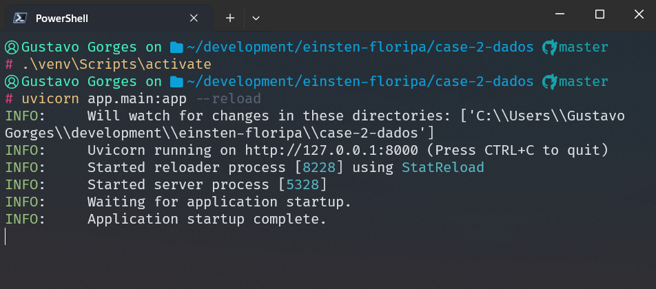
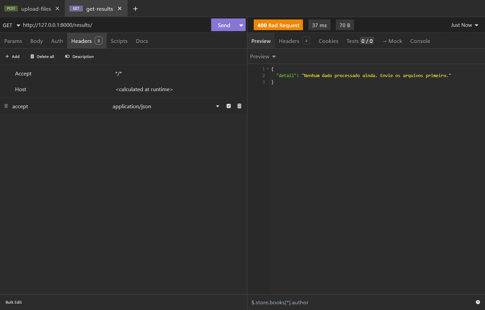
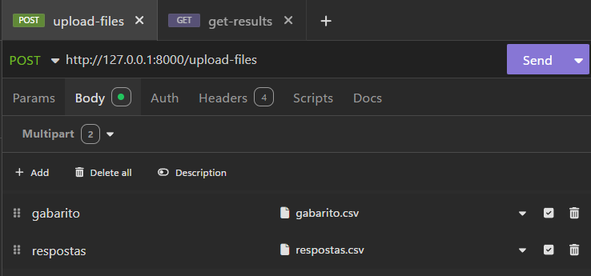
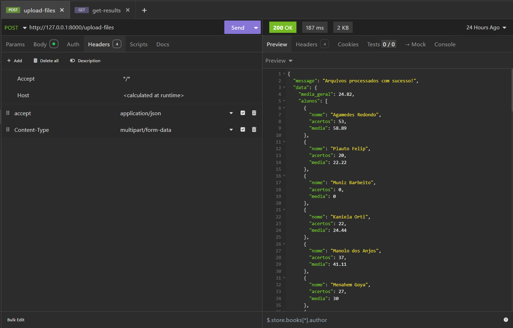
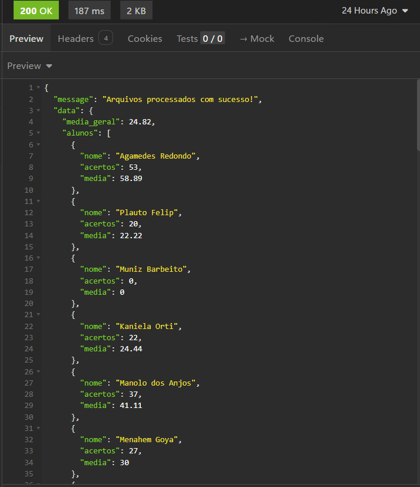
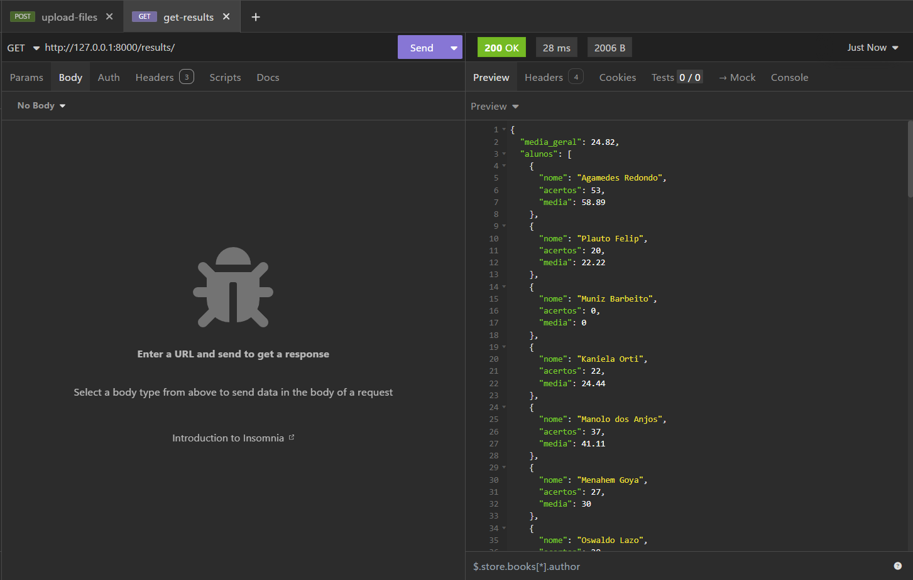

# 📌 Correção de Simulado - FastAPI

Este projeto é uma API desenvolvida em **FastAPI** para processar arquivos CSV contendo respostas de alunos e comparar com o gabarito do simulado. A API gera estatísticas de acertos por aluno e média geral.

---

## 🚀 Tecnologias Utilizadas

- **Python 3.9+**
- **FastAPI** - Framework para construção da API
- **Pandas** - Manipulação e análise de dados
- **Uvicorn** - Servidor ASGI para execução da API

---

## 📂 Estrutura do Projeto

```
.
├── .gitignore
├── README.md                # Documentação do projeto
├── app
│   ├── __init__.py
│   ├── main.py              # Arquivo principal da API
│   ├── models.py            # Modelos Pydantic
│   ├── services
│   │   └── data_processor.py # Função para processar os CSVs
│   └── utils.py             # Funções auxiliares
├── data
│   ├── gabarito.csv
│   └── respostas.csv
└── requirements.txt         # Dependências do projeto
```

---

## 🛠️ Instalação e Execução

### 1️⃣ Clonar o Repositório

```sh
 git clone https://github.com/BenoGustavo/case-2-einstein-floripa.git
 cd case-2-einstein-floripa
```

### 2️⃣ Criar e Ativar um Ambiente Virtual (Recomendado)

```sh
python -m venv venv
source venv/bin/activate  # Linux/macOS
venv\Scripts\activate     # Windows
```

### 3️⃣ Instalar Dependências

```sh
pip install -r requirements.txt
```

### 4️⃣ Executar a API

```sh
uvicorn app.main:app --reload
```

A API será iniciada em: **http://127.0.0.1:8000**

---

## 📌 Endpoints

### 📤 1. Upload dos Arquivos CSV

**Rota:** `/upload-files/`
**Método:** `POST`
**Parâmetros:** Arquivos `gabarito.csv` e `respostas.csv`

#### Exemplo de Requisição `cURL`

```sh
curl -X 'POST' \
  'http://127.0.0.1:8000/upload-files/' \
  -H 'accept: application/json' \
  -H 'Content-Type: multipart/form-data' \
  -F 'gabarito=@gabarito.csv' \
  -F 'respostas=@respostas.csv'
```

#### Exemplo de Resposta:

```json
{
  "message": "Arquivos processados com sucesso!",
  "data": {
    "media_geral": 75.6,
    "alunos": [{ "nome": "Agamedes Redondo", "acertos": 22, "media": 73.3 },...]
  }
}
```

---

### 📊 2. Obter Resultados Processados

**Rota:** `/results/`
**Método:** `GET`

#### Exemplo de Requisição `cURL`

```sh
curl -X 'GET' 'http://127.0.0.1:8000/results/' -H 'accept: application/json'
```

#### Exemplo de Resposta:

```json
{
  "media_geral": 75.6,
  "alunos": [{ "nome": "Agamedes Redondo", "acertos": 22, "media": 73.3 }]
}
```

---

### 🖼️ 3. Prints demonstrativos

- Inicializando a API:
  

- Rotas no insominia/postman:
  

- Tentando buscar dados antes de enviar os arquivos:
  

- Enviando os arquivos:

  1. Corpo da requisição:
     
  2. Headers da requisição:
     
  3. Resposta da requisição:
     

- Buscando os dados:
  
  `Sempre vai ter como base o ultimo arquivo enviado, além disso os dados são salvos em memoria para diminuir a complexidade do case.`

## 📝 Considerações

- Caso os arquivos CSV não estejam no formato correto, a API retornará um erro.
- É necessário fazer upload dos arquivos antes de consultar os resultados.
- Para testes, utilize os arquivos `gabarito.csv` e `respostas.csv` fornecidos no enunciado.
